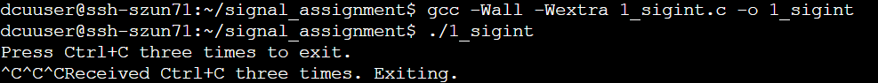
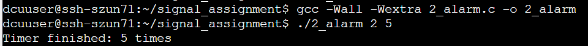
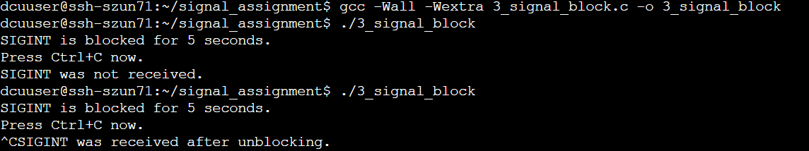

# Linux Signal Handling Assignment

## 1. 프로젝트 설명
Linux 환경에서 C 언어를 사용하여 시그널을 처리하는 프로그램을 작성하였다. 이번 과제에서는 다음 세 가지 기능을 구현하였다.
1) Ctrl+C를 세 번 눌렀을 때 프로그램이 종료되도록 구현
2) alarm()을 이용하여 일정한 간격으로 시그널이 반복되도록 구현
3) SIGINT 시그널을 일정 시간 동안 차단한 후 다시 전달되는지 확인
시그널 핸들러 등록에는 sigaction()을 사용하였으며, 시그널 핸들러에서 사용하는 공유 변수는 volatile sig_atomic_t 타입으로 선언하였다.


## 2. 구현 내용
### 2.1 Ctrl+C 3회 입력
**파일**: `1_sigint.c`
SIGINT 시그널을 처리하는 핸들러를 등록하였다.
Ctrl+C를 누를 때마다 카운터를 증가시키고, 세 번째 Ctrl+C를 받은 후 프로그램을 종료하도록 구현하였다.
시그널 핸들러에서는 카운터만 변경하고, 화면 출력은 main()에서 수행하였다.

실행 명령과 실행결과


### 2.2 반복 타이머
**파일**: `2_alarm.c`
alarm()을 이용하여 지정된 시간 간격마다 SIGALRM이 발생하도록 구현하였다. alarm()은 한 번 실행되면 한 번만 동작하기 때문에, 시그널 핸들러에서 다음 알람을 다시 설정하여 반복되도록 구현하였다.

**실행 명령과 실행 결과**

위 실행에서는 2초 간격으로 총 5회 타이머가 동작하도록 설정하였다.

### 2.3 SIGINT 차단 및 해제
**파일**: `3_signal_block.c`
sigprocmask()를 사용하여 SIGINT를 일정 시간 동안 차단하였다. 차단된 상태에서 Ctrl+C를 입력한 후 차단을 해제하면, 대기 중이던 SIGINT가 전달되는 것을 확인하였다.

실행 명령과 실행 결과

이를 통해 SIGINT가 차단된 동안 사라지지 않고 대기하였다가 차단 해제 후 전달되는 것을 확인하였다.


## 3. 컴파일 방법
각 프로그램은 다음과 같이 컴파일하였다.

|---|
| gcc -Wall -Wextra 1_sigint.c -o 1_sigint
gcc -Wall -Wextra 2_alarm.c -o 2_alarm
gcc -Wall -Wextra 3_signal_block.c -o 3_signal_block |

세 프로그램 모두 -Wall -Wextra 옵션을 사용하여 컴파일하였으며, 최종적으로 경고 없이 컴파일되는 것을 확인하였다.


## 4. AI 사용 내용
이번 과제에서 AI를 활용하여 다음과 같은 도움을 받았다.

* sigaction()을 이용한 시그널 핸들러 코드 구조 작성 도움
* alarm()을 이용한 반복 타이머 코드 구조 작성 도움
* sigprocmask()를 이용한 시그널 차단 및 해제 코드 구조 작성 도움
* README.md의 가독성을 높이기 위해 Markdown 문법과 문서 형식 수정 도움

AI가 제시한 코드 구조와 예시를 참고하여 Linux 환경에서 직접 컴파일하고 실행하였다. 컴파일 과정에서 발생한 경고를 수정하고 각 프로그램의 동작을 확인하였다.

사용한 AI 질문 예시
* Ctrl+C를 세 번 눌렀을 때 종료하는 C 프로그램의 코드 구조를 알려줘.
* alarm()을 이용해서 일정한 간격으로 반복되는 타이머 프로그램의 코드 구조를 알려줘.
* sigprocmask()를 이용해서 SIGINT를 잠시 차단하고 해제하는 프로그램의 코드 구조를 알려줘.
* README.md 파일의 제목 크기, 글씨 강조, 코드 블록을 수정할 수 있는 Markdown 문법을 알려줘.


## 5. 본인이 보강한 내용

AI의 도움을 받은 후 직접 Linux 환경에서 코드를 작성하고 실행하였다.

* gcc -Wall -Wextra를 사용하여 컴파일하였다.
* 컴파일 과정에서 발생한 unused parameter 'sig' 경고를 확인하고 (void)sig;를 추가하여 수정하였다.
* Ctrl+C를 실제로 세 번 입력하여 1_sigint.c의 동작을 확인하였다.
* ./2_alarm 2 5를 실행하여 2초 간격으로 5회 반복되는 것을 확인하였다.
* 3_signal_block.c를 실행하여 SIGINT를 차단한 상태에서 입력한 Ctrl+C가 차단 해제 후 전달되는 것을 확인하였다.


## 6. 최종 파일
```
signal_assignment/
├── 1_sigint.c
├── 2_alarm.c
├── 3_signal_block.c
└── README.md
```
